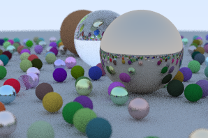

# rtiow

**R**ay **T**racing **I**n **O**neWeekend a Typescript implementation of [RayTracingInOneWeekend book](https://raytracing.github.io/books/RayTracingInOneWeekend.html), with chunks for fast(er) rendering.

This project is mainly used because _aint no real graphics programmer if no rtiow_.

